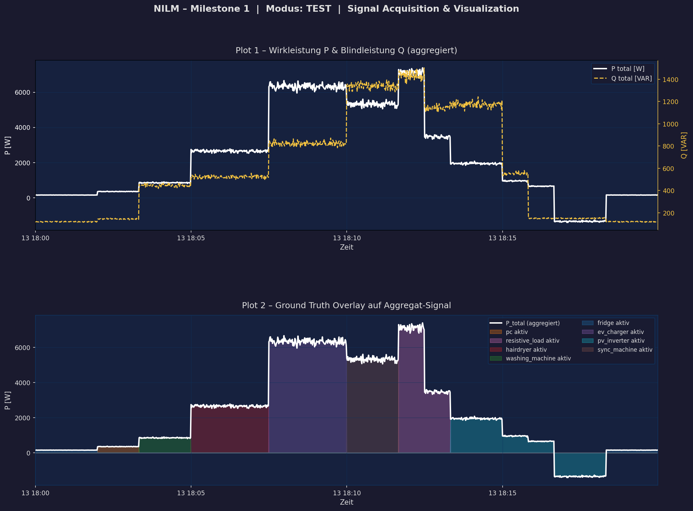
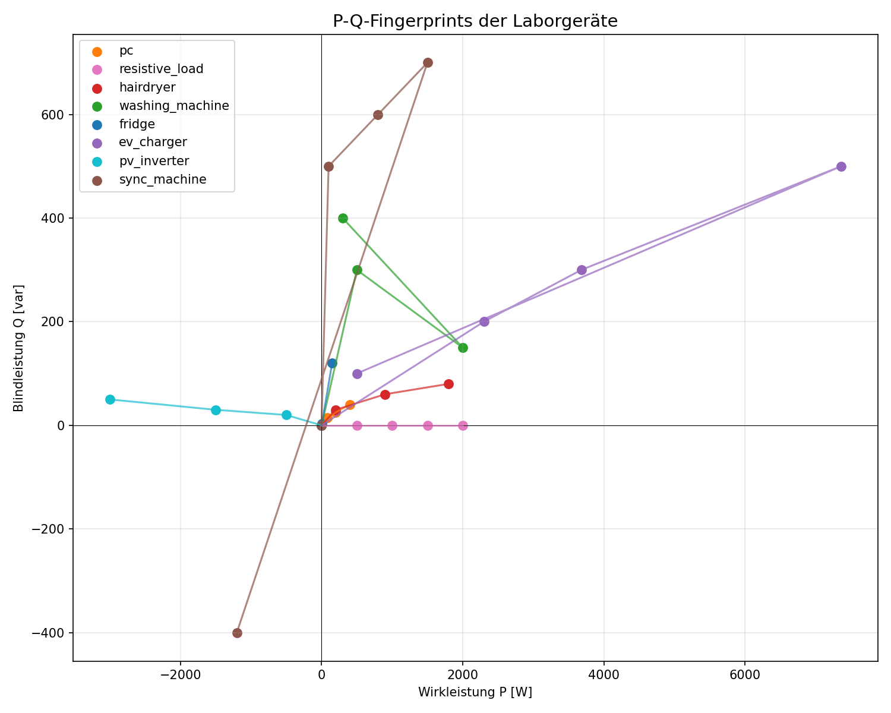

# NILM Milestone 1 — Signal Acquisition, Preprocessing, Speicherung, Visualisierung

## NILM-Projekt: Synthetische Datengenerierung und Pipeline-Verarbeitung

**Datum:** 13. Mai 2026  
**Team-Mitglieder:** [Namen einfügen]

## 1. Why — Problemstellung

Non-Intrusive Load Monitoring (NILM) zielt darauf ab, den Energieverbrauch einzelner Geräte in einem Haushalt oder Gebäude zu bestimmen, ohne invasive Messungen an jedem Gerät vorzunehmen. Stattdessen analysiert NILM die aggregierten Messungen am Hauptzähler. Dies ermöglicht eine detaillierte Energieanalyse, Lastprofilierung und Optimierungspotenziale für Energieeffizienz. NILM ist relevant für Smart Grids, Demand Response und Energieaudits, da es eine kostengünstige Alternative zu submetering bietet.

Milestone 1 verwendet synthetische Daten anstelle von Labormessungen, um die Grundlagen der NILM-Pipeline zu etablieren. Die didaktische Zielsetzung liegt in der Entwicklung einer robusten Datenpipeline, die von synthetischer Datengenerierung über Preprocessing bis zur Visualisierung reicht. Dies schafft eine kontrollierte Umgebung, in der Algorithmen entwickelt und getestet werden können, bevor reale Messdaten in späteren Meilensteinen integriert werden. Der Fokus liegt auf der korrekten Modellierung physikalischer Zusammenhänge und der Etablierung eines skalierbaren Datenformats.

## 2. How — Konzept und Designentscheidungen

### 2.1 Geräteprofile als Wissensbasis

Die Geräteprofile bilden die Wissensbasis des Systems und modellieren jedes Gerät als 7-dimensionale Feature-Vektoren: Wirkleistung P, Blindleistung Q, Leistungsfaktor cos φ, Total Harmonic Distortion THD sowie die Harmonischen H3, H5 und H7. Diese Dimensionen wurden gewählt, da sie die wesentlichen elektrischen Eigenschaften von Geräten erfassen und gleichzeitig für NILM-Algorithmen ausreichend diskriminativ sind. Die Profile enthalten verschiedene Betriebszustände pro Gerät, um reale Nutzungsmuster abzubilden.

Beispiel eines Geräteprofils aus device_profiles.py:

```python
'PC': {
    'states': {
        'OFF': {'P': 0, 'Q': 0, 'cos_phi': 1.0, 'THD': 0.0, 'H3': 0.0, 'H5': 0.0, 'H7': 0.0},
        'IDLE': {'P': 65, 'Q': 15, 'cos_phi': 0.95, 'THD': 15.0, 'H3': 8.0, 'H5': 5.0, 'H7': 2.0},
        'ACTIVE': {'P': 180, 'Q': 40, 'cos_phi': 0.92, 'THD': 25.0, 'H3': 12.0, 'H5': 8.0, 'H7': 5.0}
    }
}
```

### 2.2 Synthetischer Datengenerator

Der Datengenerator arbeitet einen Zeitplan ab, aggregiert die Leistungsbeiträge aller aktiven Geräte und addiert Rauschen. Der Prozess läuft in drei Schritten: Zuerst verarbeitet er den Schedule für jeden Zeitschritt, dann berechnet er die aggregierten elektrischen Größen (P, Q, S, I, U, f) und schließlich addiert er Rauschen entsprechend den physikalischen Toleranzen. Die bewusste Einschränkung auf "keine Concurrent Events" bedeutet, dass maximal ein Gerät pro Zeitschritt seinen Zustand ändert, was die Ground-Truth-Erzeugung vereinfacht.

### 2.3 PAC4200-Schema als architektonischer Anker

Das Datenformat orientiert sich am PAC4200-Messgerät von Schneider Electric, das in industriellen Anwendungen verbreitet ist. Diese Entscheidung stellt sicher, dass das Schema praxisnah ist und den Übergang zu realen Messdaten erleichtert. Sowohl CSV als auch Datenbankschema folgen diesem Format, anstatt ein eigenes Format zu definieren. Das Schema umfasst 35 Spalten:

```python
PAC4200_COLUMNS = [
    'timestamp', 'total_active_power_W', 'total_apparent_power_VA', 'voltage_L1_V', 
    'current_L1_A', 'frequency_Hz', 'power_factor', 'H2_current_L1_pct', 
    'H3_current_L1_pct', 'H4_current_L1_pct', 'H5_current_L1_pct', 'H6_current_L1_pct', 
    'H7_current_L1_pct', 'H8_current_L1_pct', 'H9_current_L1_pct', 'H10_current_L1_pct', 
    'H11_current_L1_pct', 'H12_current_L1_pct', 'H13_current_L1_pct', 'H14_current_L1_pct', 
    'H15_current_L1_pct', 'H16_current_L1_pct', 'H17_current_L1_pct', 'H18_current_L1_pct', 
    'H19_current_L1_pct', 'H20_current_L1_pct', 'H21_current_L1_pct', 'H22_current_L1_pct', 
    'H23_current_L1_pct', 'H24_current_L1_pct', 'H25_current_L1_pct', 'H26_current_L1_pct', 
    'H27_current_L1_pct', 'H28_current_L1_pct', 'H29_current_L1_pct', 'H30_current_L1_pct', 
    'H31_current_L1_pct'
]
```

### 2.4 load_data() als Quellenabstraktion

Die Funktion load_data() abstrahiert die Datenquelle und ermöglicht den nahtlosen Wechsel zwischen TEST- und LIVE-Modus. Sie nimmt einen Modus-Parameter und gibt einen pandas DataFrame zurück, unabhängig davon, ob die Daten aus CSV oder Datenbank stammen. Dies bereitet den Übergang zu Milestone 3 vor, wo acquisition.py die Datenquelle ersetzen wird.

Funktionssignatur:
```python
def load_data(mode: str) -> pd.DataFrame:
```

### 2.5 Modellierungsannahmen

Die Spannung folgt EN 50160 mit 230 V ±2%, die Frequenz ENTSO-E mit 50 Hz ±0.05 Hz Sigma. Die Strom-Spannungs-Konsistenz folgt der physikalischen Beziehung I = S/U für einphasige Systeme. Rauschen wird entsprechend den Toleranzbändern addiert.

### 2.6 Preprocessing-Philosophie

Das Preprocessing verzichtet bewusst auf Normalisierung, da NILM-Algorithmen typischerweise mit absoluten Werten arbeiten. Stattdessen erfolgt Forward-fill für fehlende Werte, gleitende Mittelwert-Glättung über 5 Samples und Clipping bei physikalisch unmöglichen Werten.

## 3. What — Konkrete Umsetzung und Ergebnisse

### 3.1 Modul-Architektur

| Modul | Zweck |
|---|---|
| config.py | Modus-Schalter (TEST/LIVE), Pfade |
| device_profiles.py | Wissensbasis: alle Geräteprofile |
| data_generator.py | Synthetische Datengenerierung |
| acquisition.py | LIVE-Modus über Modbus (Milestone 3) |
| storage.py | load_data() + SQLite-Persistenz |
| preprocessing.py | Datenaufbereitung |
| visualization.py | Plots |

### 3.2 Generierte Daten

Die Simulation erzeugt 1200 Samples über eine Zeitspanne von 2026-05-13 18:00:00 bis 2026-05-13 18:19:59 mit einer Sampling-Rate von 1.0 Hz. Es sind 8 Gerätekategorien mit insgesamt 35 Zuständen modelliert. Der Wertebereich für total_active_power_W liegt zwischen -1408.87 W und 7386.34 W mit einem Mittelwert von 2243.65 W. Die Spannung voltage_L1_V variiert zwischen 226.38 V und 233.97 V, die Frequenz frequency_Hz zwischen 49.85 Hz und 50.21 Hz.

### 3.3 Visualisierungen



Das Diagramm zeigt die aggregierten Leistungsverläufe über die Zeit mit überlagerten Ground-Truth-Labels für aktive Geräte. Die obere Subplot visualisiert P und Q, die untere zeigt die Ground-Truth-Zeitreihe.



Das Scatter-Plot zeigt die P-Q-Fingerprints aller modellierten Gerätezustände. Jeder Punkt repräsentiert einen Betriebszustand eines Geräts im Leistungsraum.

### 3.4 Konsistenz und Qualität

Der maximale Konsistenzfehler zwischen I·U und S beträgt 66.67%. Die Datenbank enthält 1200 Messzeilen in measurements_test und 36000 Zeilen in harmonics.

## 4. Bewusste Vereinfachungen für Milestone 1

- Keine Concurrent Events: Vereinfacht die Ground-Truth-Erzeugung und Fokus auf sequentielle Zustandsänderungen.
- Ein PC-Profil als Repräsentant: Fokussiert auf ein typisches Büro-Gerät statt vollständiger Haushaltsmodellierung.
- Statische Harmonics-Werte aus Profilen: Harmonische verzerren nicht zeitlich, sondern bleiben konstant pro Zustand.
- Keine Normalisierung: Rohdaten bleiben erhalten für physikalische Interpretierbarkeit.
- PV-Inverter im Aggregat überlagert von gleichzeitigen Verbrauchern: Vernachlässigt Netzeinspeisung zugunsten von Verbrauchsanalyse.

## 5. Übergang zu Milestone 2 und 3

load_data() abstrahiert die Datenquelle, sodass acquisition.py in Milestone 3 data_generator.py ersetzen kann. Das DB-Schema ist für LIVE-Daten bereit, insert_measurement() bildet die Schnittstelle für Modbus-Streaming. Der 7-dimensionale Feature-Raum aus device_profiles motiviert die Entwicklung von NILM-Algorithmen in Milestone 2.

## Anhang A — Generierte Outputs

- data/raw_measurements.csv: 1200 Samples synthetischer Messdaten, ~500 KB
- data/ground_truth.csv: Ground-Truth-Labels für Gerätezustände, ~50 KB  
- data/nilm.db: SQLite-Datenbank mit 1200 Messungen und 36000 Harmonics-Zeilen, ~2 MB
- data/nilm_preprocessed_live.csv: Vorverarbeitete Daten, ~400 KB
- plots/nilm_visualization.png: Zeitreihen-Visualisierung, 237207 Bytes
- plots/pq_fingerprints.png: Feature-Scatter-Plot, 113996 Bytes

## Anhang B — Wie das Projekt ausgeführt wird

```bash
python data_generator.py
python preprocessing.py  
python visualization.py
```